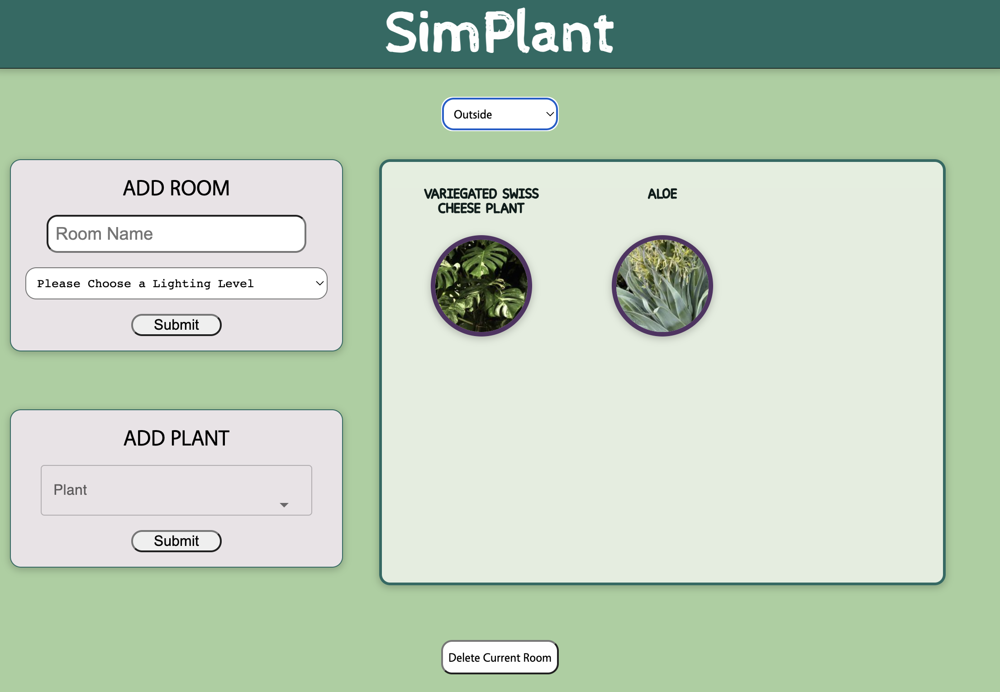

# SimPlant 🌱

## An app to monitor your plants' needs.

 

 

## Create your own SimPlant App 🌷

### Prerequisites

- [Install npm](https://docs.npmjs.com/downloading-and-installing-node-js-and-npm)

### Installation

1. Fork and close this repository to your local machine
2. Install NPM packages: `npm install`
3. Run `npm run start` to spin up the server
4. Run `npm run dev` to start up the application
5. Navigate to http://localhost:8080 in your browser
6. Grow some plants 🌵

### Testing

_Coming soon_!

### Deployment

_Coming soon_!

 

## Key Features

<video src="src/app/assets/demo.mov" controls=true width=600></video>

1. Add a room + lighting level
2. Add plants to room
3. Reorder plants
4. View information for how to care for your plant!

 

## Questions and Support

If you have any questions or need help with the project, please don't hesitate to ask! You can <a href="https://github.com/SimPlant-App/SimPlantV2">create an issue</a> on this repo 🌼

 

## Tech Stack

 

[![JavaScript][JavaScript]][JavaScript-url] [![React][React.js]][React-url]   [![HTML5][HTML5]][HTML5-url] [![SASS][SASS]][SASS-url]  

 

## The Team

|  Developed By  |                                                                                                                                                    |                                                                                                                                                       |
| :------------: | :------------------------------------------------------------------------------------------------------------------------------------------------: | :---------------------------------------------------------------------------------------------------------------------------------------------------: |
| Lane Hamilton  |         |         |
|  Lily Mueller  |  |  |
|   Eric Tjon    |           |                |
|    Harry Vu    |        |                    |
| Esther Witbeck |        |          |
|   Megan Choi   |          |                 |
| Jake Crawford  |     |         |
| Shimmy Gabbara |         |           |

Forked from https://github.com/SimPlant/SimPlant 🪴

 

## License

Distributed under the MIT License.

 

Special thanks to furby 🌺

 

<!-- Logo Links -->

[React.js]: https://img.shields.io/badge/react-%2320232a.svg?style=for-the-badge&logo=react&logoColor=%2361DAFB
[React-url]: https://reactjs.org/
[JavaScript]: https://img.shields.io/badge/javascript-%23323330.svg?style=for-the-badge&logo=javascript&logoColor=%23F7DF1E
[JavaScript-url]: https://www.javascript.com/
[HTML5]: https://img.shields.io/badge/html5-%23E34F26.svg?style=for-the-badge&logo=html5&logoColor=white
[HTML5-url]: https://developer.mozilla.org/en-US/docs/Web/HTML/
[SASS]: https://img.shields.io/badge/SASS-hotpink.svg?style=for-the-badge&logo=SASS&logoColor=white
[SASS-url]: https://sass-lang.com/
